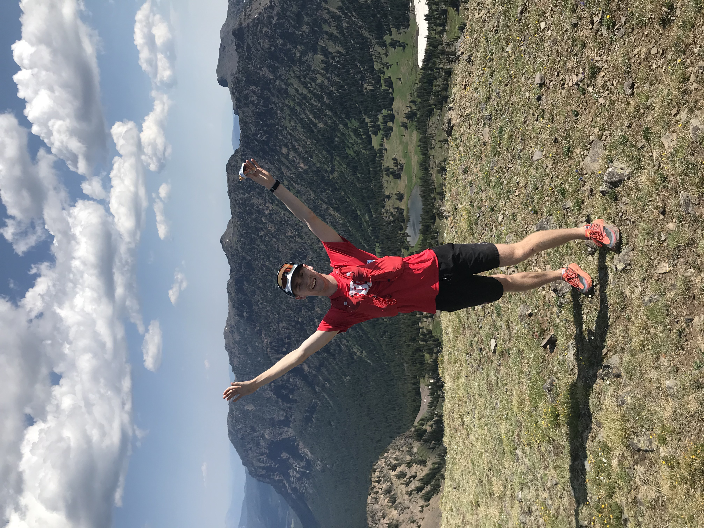

  

Hi! I'm Julian, a third-year Ph.D. student in Environmental Science and Engineering at Caltech. I work with [Tapio Schneider](https://climate-dynamics.org/people/tapio-schneider/) as a member of the [Climate Modeling Alliance](https://clima.earth/), where I'm applying mathematical tools and machine learning to tackle climate problems.

At CliMA, this includes developing a new framework for diagnosing and improving model calibration in the non-differentiable slow 
forward model setting. I've been applying this framework to CliMA's atmosphere model, [ClimaAtmos.jl](https://github.com/CliMA/ClimaAtmos.jl), by 
developing more efficient loss functions. I'm also developing a new ML closure for the atmosphere model's representation of clouds. Interested in the 
machine learning revolution in the numerical weather prediction world, I am exploring history and space tradeoffs in the Neural Operator setting.

Beyond research, I enjoy coordinating weekly trail runs for the Caltech Alpine Club in the beautiful San Gabriel Mountains, where I get to enjoy both the outdoors and the awesome local running community.

Before joining Caltech, I completed my Applied Mathematics degree at Harvard University in 2023, where I had the opportunity to work on diverse projects spanning high-performance computing, climate modeling, and statistical methods. I collaborated with [Marine Denolle](https://denolle-lab.github.io/) on seismic waveguide analysis using Julia and AWS, with [Mimi Hughes](https://psl.noaa.gov/people/mimi.hughes/), [Nathaniel Johnson](https://www.gfdl.noaa.gov/nathaniel-johnson-homepage/), and [Kai-Chih Tseng](https://kuiper2000.github.io/) on snow drought climatology, and with [Kelly McConville](https://mcconville.rbind.io/) on forest carbon estimation. I also worked briefly as a software engineer at [Coolant](https://coolant.earth/), developing machine learning tools for carbon stock quantification.

<!-- Pictures of me doing fun things! 
==== -->
<!-- 

 -->

<!-- Hi! I'm Julian, a third-year Ph.D. student in Envrionmental Science and Engineering at Caltech working with [Tapio Schneider](https://climate-dynamics.
org/people/tapio-schneider/) as a member of the [Climate Modeling Alliance](https://clima.earth/). I'm broadly interested in applying mathematical tools 
to climate problems. At CliMA, this includes developing a new framework for diagnosing and improving model calibration in the non-differentiable slow 
forward model setting. I've been applying this framework to CliMA's atmosphere model, [ClimaAtmos.jl](https://github.com/CliMA/ClimaAtmos.jl), by 
developing more efficient loss functions. I'm also developing a new ML closure for the atmosphere model's representation of clouds. Interested in the 
machine learning revolution in the numerical weather prediction world, I am exploring history and space tradeoffs in the Neural Operator setting. I enjoy 
coordinating weekly trail runs for the Caltech Alpine Club in the nearby San Gabriel Mountains.
Before Caltech, I completed my Bachelor's degree in Applied Mathematics at Harvard University in 2023 where I worked with [Marine Denolle](https://
denolle-lab.github.io/) to develop a high-performance computing framework in the Julia Programming Language on Amazon Web Services, [Mimi Hughes](https://
psl.noaa.gov/people/mimi.hughes/), [Nathaniel Johnson](https://www.gfdl.noaa.gov/nathaniel-johnson-homepage/), and [Kai-Chih Tseng](https://kuiper2000.
github.io/) to track the future of snow droughts across the Western United States, and with [Kelly McConville](https://mcconville.rbind.io/) to design 
more robust estimators for studying U.S. forests. Post-grad, I worked briefly for [Coolant](https://coolant.earth/) as a software engineer developing 
machine learning tools for high-resolution carbon stock quantification. -->