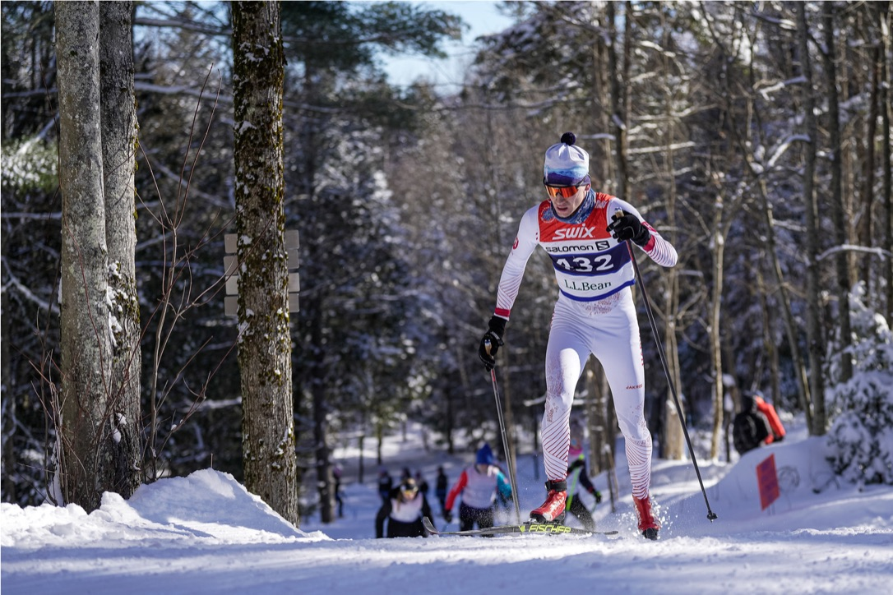

Background
======
Since my sophomore year, I've trained and competed with the Harvard Varsity Nordic ski team, a.k.a. cross country skiing - it's the one where you go up as well as down hills :). I walked onto the team after wanting a change from the clubs and club sports teams I participated in during my freshman year. Racing and training at the collegiate level has been incredibly rewarding and I've made some of my closest friends. My top finish to-date is a 35th place finish in a mass start skate 20k. I am looking forward to one final 2023 race season! 

Links
------
Team Webiste: [Harvard Skiing](https://gocrimson.com/sports/alpine-skiing)
My Harvard Crimson Profile: [Julian Schmitt](https://gocrimson.com/sports/alpine-skiing/roster/julian-schmitt/24928)
